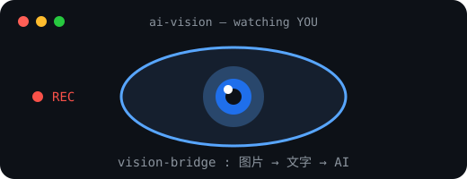
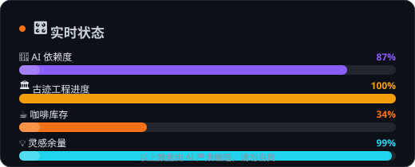
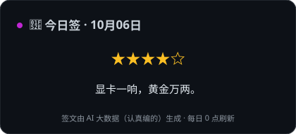
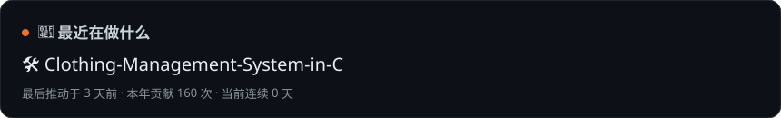
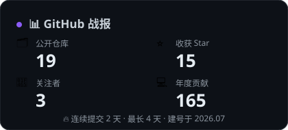
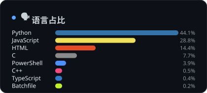
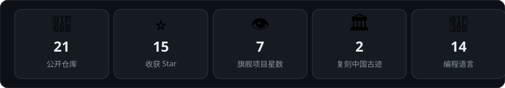

<!-- 🎉 彩蛋：翻到源码的人最可爱 · 这只端着咖啡的猫送给你：/\_/\  ( =^･ω･^= )  -->

  

  
  
  
  

## 👀 关于我

- 🎓 **学生开发者**——仓库是我这两个月的成长记录，现在有 **18 个公开仓库 · 15 颗星**
- 👀 代表作：给纯文本 AI 装上"眼睛"的 **Vision Bridge**，让 DeepSeek 们也能看懂截图
- 🏛 最近沉迷于让 AI 在 Blender 里**实时复刻中国古迹**：天坛和佛山祖庙都盖好了
- 🈶 顺手把 Cursor、Claude Desktop 都汉化了——哪里有英文界面，哪里就有我
- ⚡ 相信一件事：**人和 AI 一起做东西，最好玩**

  

## 🎛 实时状态

  

## 🔮 今日签

  

## 📡 最近动态

  

## 🎮 主页游乐场

> 你是一名刚降落在 qiyuechen0929 主页的 AI 探险者。三条支线，各藏一个彩蛋，全部通关可解锁终极答案。

### 🏛️ 支线一 · 古迹工地

亲眼看看 AI 怎么在 Blender 里，用一条条 bpy 代码把天坛和祖庙"长"出来——白天版 + 夜景版 + 相机巡游视频，全开源：

👉 [blender-heritage-scenes](https://github.com/qiyuechen0929/blender-heritage-scenes)

**🎁 彩蛋**：下面这幅天坛夜景是**会动的**——星星会闪、流星会划过、祈年殿的窗灯在忽明忽暗（刷新页面看流星）。

### 👁️ 支线二 · AI 实验室

上面那只一直在扫描你的眼睛，出生证明在这里：[Vision Bridge](https://github.com/qiyuechen0929/vision-bridge)（7★）。
它还学会了多通道视觉降级方案：[Codex 视觉桥全攻略](https://github.com/qiyuechen0929/Common-solutions-to-fix-missing-vision-when-integrating-DeepSeek-into-Codex)。

### 🕹️ 支线三 · 街机机台

五台纯前端游戏，全部单文件、下载即玩：

| 机台 | 玩法 |
|---|---|
| [MagnetRush · 磁能狂飙](https://github.com/qiyuechen0929/MagnetRush) | 三技能 + 16 种装备 + AI 语音 |
| [GestureRacer · 手势竞速](https://github.com/qiyuechen0929/GestureRacer) | 双手手势开车，拳头是油门 |
| [GestureTree · 手势圣诞树](https://github.com/qiyuechen0929/GestureTree) | 手势切换四种照片展示模式 |
| [GestureOrbit · 全向卡牌环](https://github.com/qiyuechen0929/GestureOrbit) | 手掌就是全向摇杆 |
| [TriChessInn · 三棋小馆](https://github.com/qiyuechen0929/TriChessInn) | 象棋围棋五子棋，水墨风 AI 对弈 |

通关终极答案：<b>人和 AI 一起做东西，最好玩。</b>

## 📊 GitHub 数据

  
  

## 🏆 成就墙

  

## 🐍 贡献贪吃蛇

<picture>
  <source media="(prefers-color-scheme: dark)" src="https://raw.githubusercontent.com/qiyuechen0929/qiyuechen0929/output/github-contribution-grid-snake-dark.svg"/>
  
</picture>

  <b>人和 AI 一起做东西，最好玩。</b> 
  由 📡 主页引擎每 6 小时自动驱动 · 用 ZCode(GLM) + Blender 5.0 建成

